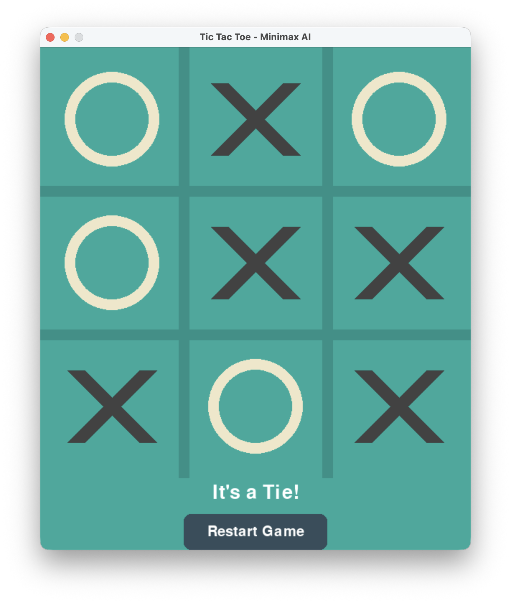

# MiniMax Tic Tac Toe

A Tic Tac Toe game with an AI opponent powered by the Minimax algorithm. The AI plays perfectly and cannot be beaten!



## Description

This project implements a classic Tic Tac Toe game with a graphical user interface built using Pygame. The computer opponent uses the Minimax algorithm to evaluate all possible moves and always choose the optimal play. The best you can do is tie!

### Features

- 🎮 Interactive graphical interface built with Pygame
- 🤖 Unbeatable AI using the Minimax algorithm
- 🎨 Clean, modern visual design
- 🔄 Easy restart functionality
- 💡 Perfect for learning about game theory and AI algorithms

## How the Minimax Algorithm Works

The Minimax algorithm is a decision-making algorithm used in two-player games. It works by:

1. **Exploring all possible moves** recursively to determine the best outcome
2. **Maximizing** the AI's score when it's the AI's turn
3. **Minimizing** the AI's score when it's the human player's turn (assuming optimal play)
4. **Evaluating terminal states** (win, loss, or tie) and assigning scores
5. **Choosing the move** that leads to the best guaranteed outcome for the AI

The algorithm ensures the AI always plays optimally, making it impossible to beat (though you can tie!).

## Requirements

- Python 3.6 or higher
- Pygame

## Installation

1. Clone this repository:
```bash
git clone https://github.com/swhelan123/MiniMax.git
cd MiniMax
```

2. Install the required dependencies:
```bash
pip install pygame
```

## Usage

Run the game from the `tictactoe` directory:

```bash
cd tictactoe
python tictactoe.py
```

### How to Play

1. The game starts with you (X) going first
2. Click on any empty square to place your X
3. The AI (O) will automatically make its move
4. Continue taking turns until someone wins or the board is full
5. Click the "Restart Game" button to play again

### Game Rules

- Players alternate placing their marks (X or O) in empty squares
- The first player to get 3 marks in a row (horizontally, vertically, or diagonally) wins
- If all squares are filled and no player has won, the game is a tie

## Project Structure

```
MiniMax/
├── tictactoe/
│   ├── tictactoe.py      # Main game file with Minimax AI implementation
│   └── screenshot.png     # Screenshot of the game
├── .gitignore            # Git ignore file
├── .gitattributes        # Git attributes file
└── README.md             # This file
```

## Code Overview

The main components of `tictactoe.py`:

- **Game Setup**: Pygame initialization, window creation, and color scheme
- **Drawing Functions**: Render the grid, X and O marks, and UI elements
- **Game Logic**: Check for wins, validate moves, manage game state
- **Minimax Algorithm**: AI decision-making logic
- **Event Loop**: Handle user input and game flow

## Learning Resources

Want to learn more about the Minimax algorithm?

- [Minimax Algorithm in Game Theory](https://en.wikipedia.org/wiki/Minimax)
- [Introduction to AI Game Programming](https://www.neverstopbuilding.com/blog/minimax)
- [Pygame Documentation](https://www.pygame.org/docs/)

## Contributing

Feel free to fork this project and submit pull requests with improvements!

## License

This project is open source and available for educational purposes.

## Author

Created by swhelan123

---

Enjoy playing against an unbeatable AI! 🎮🤖
